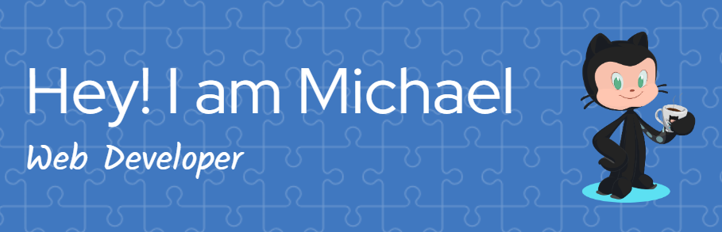

En este espacio comparto algunos de mis proyectos, experimentos y trabajo relacionado con 
Html, Css, JavaScript, NodeJS, React js, Tailwin, Bootstrap

Mi objetivo es contribuir a la comunidad de desarrolladores y apasionados por la tecnología, compartiendo conocimientos, soluciones y experimentos que puedan ser útiles para otros.

Siento una gran pasión y disfruto mucho del proceso de aprendizaje continuo que implica este campo. Me esfuerzo por mantener un enfoque curioso, creativo e innovador en mis proyectos.

Si tienes alguna pregunta, comentario o sugerencia, no dudes en ponerte en contacto conmigo. Me encanta recibir feedback y participar en discusiones enriquecedoras. ¡Espero que disfrutes explorando mi repositorio!

Saludos,
### Skills

