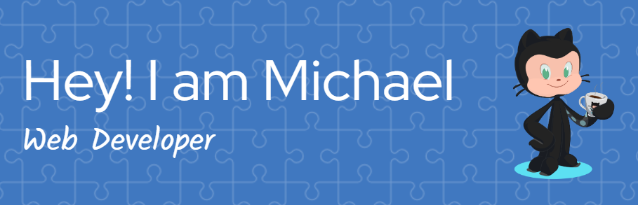

  

  <h1>Carlos Michael Barboza</h1>
  <h3>AI Automation Engineer · Full Stack Developer · AI Solutions Consultant</h3>

  

    <b>Diseño agentes autónomos, automatizo procesos de negocio y desarrollo plataformas web escalables potenciadas por IA.</b> 
    <i>Building autonomous agents, automating business workflows, and engineering AI-first web applications.</i>
  

  

    📍 Buenos Aires, Argentina · 🌎 Disponible para trabajo remoto · 🟢 Open to work
  

  

    
    
    
    
  

---

### 👨‍💻 Sobre mí

Soy desarrollador y estudiante avanzado de **Análisis de Sistemas** (Instituto ORT Argentina, egreso 2027), con certificación como **AI Consultant**. Mi especialidad es unir la ingeniería de software tradicional con **inteligencia artificial aplicada**, transformando flujos manuales e ineficientes en arquitecturas autónomas y sistemas de alta disponibilidad.

- 🤖 **IA Generativa & Agentes:** Integración de LLMs (OpenAI, Anthropic, locales con Ollama), arquitecturas RAG, function calling y agentes autónomos.
- ⚡ **Automatización Inteligente:** Orquestación de pipelines complejos con n8n, webhooks y Python para reducir costos operativos y eliminar tareas repetitivas.
- 🚀 **Desarrollo Full Stack:** Aplicaciones web modernas con React, Next.js, Node.js y Python, diseñadas para consumir y renderizar flujos de IA en tiempo real (streaming, paneles interactivos).
- 📐 **Ingeniería & Análisis:** Modelado de sistemas (UML), código desacoplado y arquitecturas preparadas para producción.

---

### 💼 Experiencia

| Rol | Organización | Enfoque & Impacto |
| :--- | :--- | :--- |
| **AI & Full Stack Developer** | Independiente / Freelance | Diseño e implementación de sistemas web y agentes automatizados (n8n, Python, LLMs) para pymes, reduciendo tiempos manuales de procesamiento de datos y atención al cliente. |
| **Technical Lead** | No Country | Liderazgo técnico de equipo ágil: toma de decisiones de arquitectura, revisión de pull requests, mentoring y cumplimiento de entregas en producción. |
| **Intern Developer** | Synerfy | Desarrollo, refactorización y mantenimiento de módulos frontend y backend en entorno productivo colaborativo. |

---

### 🛠️ Stack Tecnológico

#### 🤖 Inteligencia Artificial & Automatización

  
  
  
  
  
  

#### 🖥️ Frontend & UI

  
  
  
  
  
  
  

#### ⚙️ Backend, APIs & Bases de Datos

  
  
  
  
  

#### ☁️ DevOps & Herramientas

  
  
  
  

---

### 📂 Proyectos Destacados

#### 🔹 [AI Autonomous Workflow & Agent Pipeline](https://github.com/CarlosMBarboza)
- **Problema:** Procesos operativos repetitivos que consumían tiempo de análisis y carga manual de información.
- **Solución:** Sistema de automatización con agentes y webhooks que procesa documentos, clasifica eventos y ejecuta acciones en plataformas de terceros.
- **Stack:** Python · n8n · LangChain · OpenAI API / Local LLMs · Webhooks
- **Enlaces:** [Ver Repositorio](https://github.com/CarlosMBarboza)

#### 🔹 [AI-Driven Full Stack Application](https://github.com/CarlosMBarboza)
- **Problema:** Necesidad de consultar y gestionar datos dinámicos mediante interfaces asistidas por IA en tiempo real.
- **Solución:** Aplicación web interactiva con autenticación, streaming de respuestas de modelos de lenguaje y panel de métricas.
- **Stack:** Next.js · TypeScript · Node.js · PostgreSQL / MongoDB · Tailwind CSS
- **Enlaces:** [Ver Repositorio](https://github.com/CarlosMBarboza) · [Ver Demo en Vercel](https://vercel.com/carlosmbarbozas-projects)

---

### 🎓 Formación y Certificaciones

- 🎓 **Tecnicatura en Análisis de Sistemas** — Instituto ORT Argentina *(En curso, egreso 2027)*
- 🤖 **AI Consultant** — EducaciónIT & Manhattan University
- ✍️ **Certified Prompt Engineering Foundation Professional Certificate (CPEFPC™)**

---

### 📊 Actividad en GitHub

  
  

---

### 🤝 Trabajemos juntos

Estoy abierto a oportunidades como **AI Automation Engineer**, **AI Solutions Consultant** y **Full Stack Developer**.

  📫 <a href="mailto:michaelbarboza7@gmail.com">michaelbarboza7@gmail.com</a> &nbsp;|&nbsp; 
  💼 <a href="https://www.linkedin.com/in/carlos-michael-barboza-54ba5a61">LinkedIn</a> &nbsp;|&nbsp; 
  🚀 <a href="https://vercel.com/carlosmbarbozas-projects">Demos en Vercel</a>

